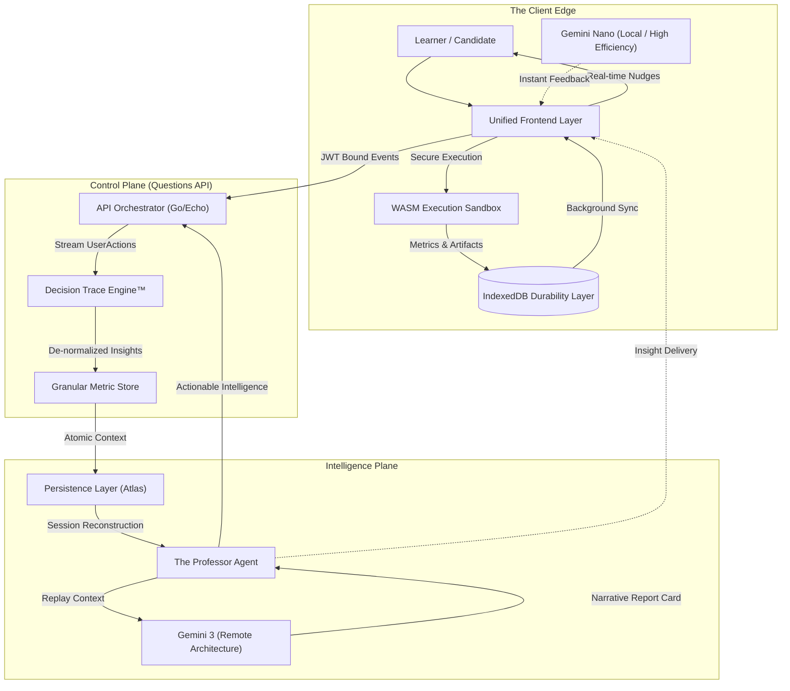

# Pathion Vibe Orchestrator

**Enterprise-Grade Skill Verification & Cognitive Intelligence Infrastructure.**

Pathion Vibe Orchestrator is a high-fidelity platform designed to autonomously assess, verify, and coach technical talent. By capturing the **cognitive journey** of developers through granular telemetry and session forensics, we provide a level of skill verification that traditional assessments cannot match.

---

## 🏗 High-Level Architecture

The platform is built on an **Intelligence Feedback Loop** that connects minute client-side execution telemetry with multi-agent AI analysis.

---

## ⚡ Core Value Propositions

### 1. Decision Trace Engine™ (Minute Metrics & Forensics)
Traditional platforms only see the final submission. In Pathion we index every decision point in the candidate's session.
- **Granular UserActions**: Every run, edit, and state change is captured as a high-fidelity building block.
- **Millisecond Telemetry**: Tracking `durationMs`, `ttfrMs` (Time To First Run), and memory heap allocation to assess solution efficiency.
- **Invariance Snapshotting**: Capturing structured data states (Linked Lists, Graphs) during execution to detect "lucky guesses" vs. "structural understanding."

### 2. Multi-Tiered Cognition (The Professor Agent)
Our "Professor" layer provides a stratified approach to mentorship:
- **Local Intelligence (Gemini Nano)**: Running locally in a **high-efficiency configuration**, Gemini Nano provides sub-second nudges and syntax-aware coaching directly on the client edge.
- **Cloud Cognition (Gemini 3)**: Our remote architecture performs deep narrative analysis of the entire `SessionArtifact` bundle, generating B2B-ready "Report Cards" with evidence-backed citations.

### 3. Verification Sandbox (WASM/Pyodide Efficiency)
By pushing the execution environment to the client's browser, we achieve secure, zero-latency validation with significant enterprise advantages:
- **Massive Performance**: Sub-second test cycles without the overhead of network round-trips for code execution.
- **Cost Optimization**: Drastically reduces server-side compute costs by offloading high-frequency execution tasks to the client's CPU.
- **Infinite Scalability**: The execution engine scales horizontally with the user base—each learner's machine acts as a dedicated, sandboxed runner.

### 4. Network Resilience & Offline Synchronization
Pathion Vibe is designed for real-world connectivity environments, utilizing a sophisticated multi-layer caching and scheduling system.
- **Durable Local Buffer**: Leverages **IndexedDB** to capture every `UserAction` and `SessionArtifact` in a persistent local queue.
- **Intelligent Background Sync**: A background scheduler monitors connectivity (Health Checks) and flushes the local cache to the **Decision Trace Engine™** only when the connection is stable.
- **Offline-First Workflow**: Learners can continue to code, run tests, and receive local AI feedback (via Gemini Nano) even when completely disconnected, with state automatically reconciling upon reconnection.

---

## 🛠 Strategic Technology Stack

| Layer | Technology | Rationale |
| :--- | :--- | :--- |
| **Edge Logic** | Gemini Nano (Local) | Ultra-fast local-only intelligence feedback. |
| **Logic** | Go (Golang) 1.21+ | High-concurrency orchestration for streaming `UserActions`. |
| **Execution** | WASM (WebAssembly) | Secure, client-side execution sandbox via Pyodide. |
| **Persistence** | MongoDB Atlas | Flexible schema for complex `SessionArtifact` forensics. |
| **Identity** | Supabase | Production-ready Auth & Role-Based Access Control (RBAC). |
| **Analysis** | Gemini 3 | SOTA LLM Agent for longitudinal behavioral assessments. |

---

*© 2026 Pathion Vibe. All rights reserved. Confidential & Proprietary.*
